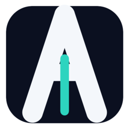

<p align="center">
  
</p>

# Amai VS Code Bridge

`Amai VS Code Bridge` adds the public `Amai` surface inside `VS Code` / `Codium`:

- `Amai` activity-bar icon
- `Amai` sidebar view
- workspace chat launch commands
- public `vscode://amai.amai-vscode-bridge/open-clean-chat` bridge for restore flows

This extension is the `VS Code` surface for `Amai`.
It is **not** the full Amai install by itself.

## Verified Scope

The currently verified contour is:

- `Linux`
- `VS Code` or `Codium`
- local GitHub install of `Amai`

Other operating systems and client contours are still in development.

## Prerequisites

Before using this extension, the currently verified contour expects:

- `Linux`
- `bash`
- `git`
- `curl` for the primary GitHub bootstrap path
- `code` CLI from `VS Code` or `Codium`
- `systemd --user` for the managed local `amai-stack.service`

## Before You Install The Extension

Install `Amai` first.

Normal network:

```bash
bash <(curl -fsSL https://raw.githubusercontent.com/neo-2022/amai/main/scripts/install_from_github.sh) --client vscode --stack-profile default --yes
```

If `raw.githubusercontent.com` is blocked or unstable:

```bash
rm -rf ~/.local/share/amai/repo && \
git clone --depth 1 https://github.com/neo-2022/amai.git ~/.local/share/amai/repo && \
cd ~/.local/share/amai/repo && \
./scripts/install_amai.sh --client vscode --stack-profile default --yes
```

That install materializes the local Amai repo, the stack bootstrap contour, the MCP config surface, and the `VS Code` bridge bundle.

## Install The Extension

You can install it from the `Extensions` view in `VS Code` / `Codium` by searching for:

`Amai VS Code Bridge`

Published extension:

- OpenVSX: https://open-vsx.org/extension/amai/amai-vscode-bridge

If you prefer CLI install:

```bash
code --install-extension amai.amai-vscode-bridge --force
```

## How To Open Amai In VS Code

1. Open the Amai workspace in `VS Code` / `Codium`.
2. Reload the window once after install.
3. Click the `Amai` icon in the activity bar.
4. Use one of these actions:
   - `Open in Sidebar`
   - `Open in Panel`

Available commands:

- `Amai: Open Clean Codex Chat`
- `Amai: Open Workspace Chat in Sidebar`
- `Amai: Open Workspace Chat in Panel`
- `Amai: Focus Sidebar`

## How To Verify It Connected

After install, the expected local contour is:

- local repo exists at `~/.local/share/amai/repo`
- workspace file `.vscode/mcp.json` exists
- `amai-stack.service` is active
- the `Amai` activity-bar icon is visible

Note:

- the current verified local contour expects a working `systemd --user` environment
- if your Linux setup does not use `systemd --user`, the extension page is not claiming that contour as verified yet

Useful checks:

```bash
cd ~/.local/share/amai/repo && ./scripts/status.sh
```

```bash
systemctl --user is-active amai-stack.service
```

```bash
code --list-extensions --show-versions | grep -F amai.amai-vscode-bridge
```

## Troubleshooting

### The `Amai` icon does not appear

- Reload the `VS Code` / `Codium` window.
- If needed, fully close the client and open it again.

### The extension is installed, but Amai does not connect

Check:

- `~/.local/share/amai/repo` exists
- `.vscode/mcp.json` exists in the workspace
- `systemctl --user is-active amai-stack.service` returns `active`

### Install fails with stale `ami-*` container conflicts

The current public install contour is designed to reclaim stale conflicting `ami-*` containers from another Amai repo root automatically.

If you still hit a stale-stack failure, capture the exact install output and inspect:

```bash
systemctl --user status amai-stack.service
```

```bash
journalctl --user -u amai-stack.service -n 120 --no-pager
```

### Remove Amai completely

```bash
~/.local/share/amai/repo/scripts/remove_amai.sh --client vscode
```

## URI Shape

`vscode://amai.amai-vscode-bridge/open-clean-chat?prompt_file=...&result_file=...&repo_root=...&target=sidebar&auto_submit=1`

## License

`PolyForm Noncommercial 1.0.0`
